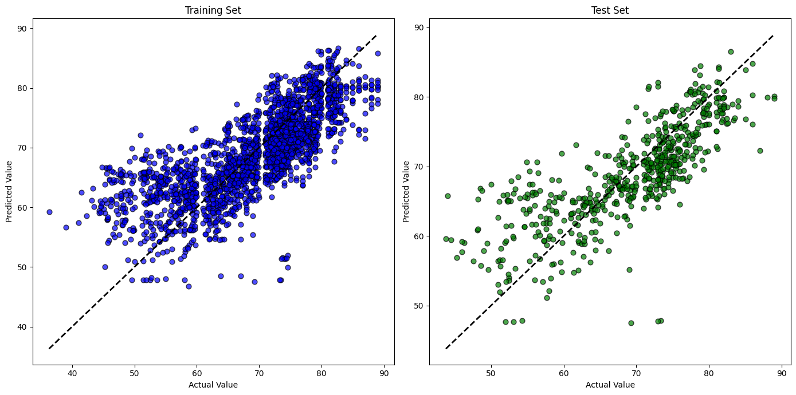

# Life Expectancy Prediction with Adaline

## Description
This project implements an Adaline (Adaptive Linear Neuron) model to predict life expectancy using the 'Life Expectancy Adap' dataset. The model is trained to exclude variables such as 'Year', 'Country', 'Status', and 'Life expectancy' itself for making predictions.

## Dataset
The 'Life Expectancy Adap' dataset was obtained and is used to train the Adaline model. The independent variables include various factors that may influence life expectancy, while the dependent variable is life expectancy itself.

## Preprocessing
Data is treated to handle NaN values, normalized, and split into training and testing sets.

## Adaline Model
The Adaline model is initialized with a learning rate of 0.0001 and trained for 100 epochs. The model adjusts its weights and bias based on the error calculated between predicted and actual values.

## Model Evaluation
The model is evaluated using Mean Squared Error (MSE) and Pearson's Coefficient to measure the accuracy of predictions on both the training and testing sets.

## Performance Graphs
The following graphs show the Adaline network's performance in creating a relationship between the actual and predicted values for the training and test sets.

## How to Run
To run this project, you will need to change the directory in the code to point to where your dataset is stored. After that, simply run the Python script to train the model and view the results.

## Dependencies
- pandas
- numpy
- matplotlib
- scikit-learn
- scipy

